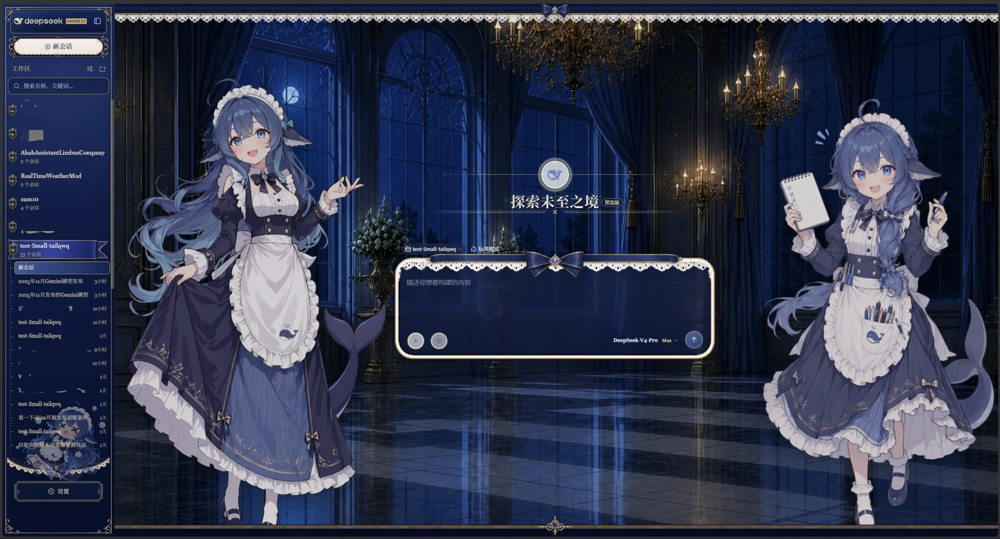
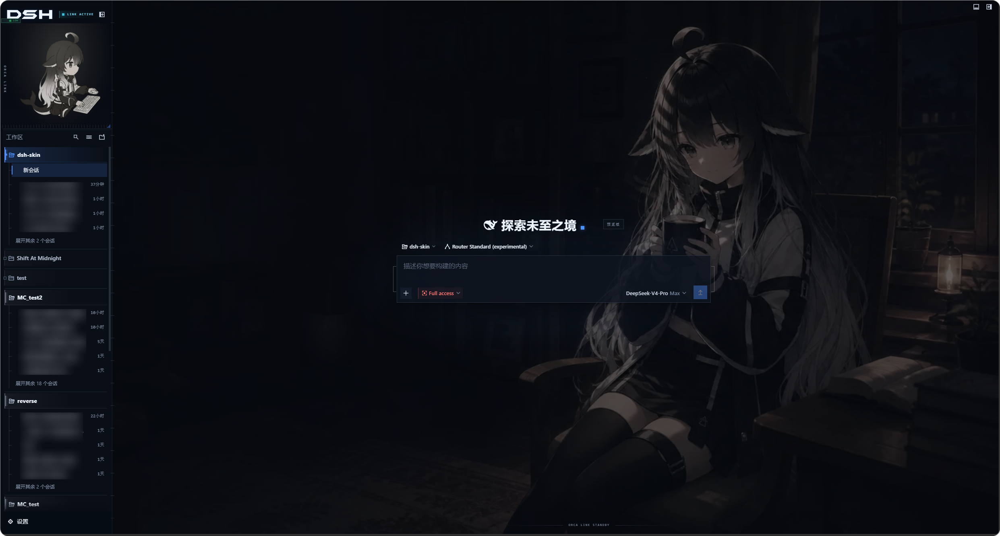

# dsh-deep-whale · 鲸鱼娘皮肤系列

DeepSeek Harness Web GUI 的鲸鱼娘主题皮肤系列(独立分发仓库)。

## 效果预览

点击图片可查看完整尺寸。

| 皮肤 | 亮色模式 | 暗色模式 |
|---|---|---|
| maid-atelier | [](maid-atelier/preview/light.webp) | [](maid-atelier/preview/dark.webp) |
| orca-link | [](orca-link/preview/light.png) | [](orca-link/preview/dark.png) |

## 住户

| 皮肤 | 包名 | 说明 | 许可 |
|---|---|---|---|
| [maid-atelier](maid-atelier/) | `@dsh-external/dsh-client-ui-skin-maid-atelier` | 深海女仆工坊:双女仆背景、深海蓝蕾丝界面与 Q 版侧栏 | CC BY-NC-SA 4.0 |
| [orca-link](orca-link/) | `@dsh-external/dsh-client-ui-skin-orca-link` | 虎鲸链路:珍珠白机械舱、黑曜虎鲸操作员与电蓝链路信号 | CC BY-NC-SA 4.0 |

## 版权所有人

| 版权所有人 | 版权所有内容 | 对应皮肤 | 个人主页 |
|---|---|---|---|
| 上善 | 鲸鱼娘角色形象原作 | maid-atelier / orca-link | [Pixiv](https://www.pixiv.net/users/62155430) · [Bilibili（上善无形）](https://b23.tv/8h5L4xz) |
| ZipZipPipe | 加入 DeepSeek 元素的女仆鲸鱼娘二次设计 | maid-atelier | [Pixiv](https://www.pixiv.net/users/18604994) · [Bilibili（ZipZipPipe）](https://b23.tv/Pnw6nG8) |

\*反馈问题尽可能在 issue 中发起，而不是跑去联系上面两位老师。但是，看鲸鱼娘二创可以去关注一下，谢谢喵

## 安装

### 懒人版

对你的 dsh 说：
```
安装一下这个皮肤包：https://github.com/Small-tailqwq/dsh-deep-whale
```

```sh
git clone https://github.com/Small-tailqwq/dsh-deep-whale
cd <harness>
dsh plugin --profile web add ../dsh-deep-whale/maid-atelier   # 深海女仆工坊
# 或: dsh plugin --profile web add ../dsh-deep-whale/orca-link   # 虎鲸链路
```

### 懒人版 · 自带技能

本仓库自带 `dsh-skin-install` 技能（`.agents/skills/`）。dsh 在仓库目录内运行时自动发现该技能；对你的 dsh 说"安装一下这个皮肤包"或"切换皮肤"，它会列出仓库全部皮肤、询问你要激活哪一套，并交代作者署名链与许可边界后再安装。无需自行克隆到 dsh 源码里，皮肤开关走配置热重载，无需重启。

## 许可

本仓库各皮肤为**衍生创作**,整体以 CC BY-NC-SA 4.0(署名-非商业性使用-相同方式共享)发布,禁止商业性使用。署名链见各皮肤 `NOTICE`。

皮肤工程脚手架来自 [zhu1090093659/dsh-web-ui](https://github.com/zhu1090093659/dsh-web-ui) ,本仓库仅分发皮肤成品,不包含脚手架。
